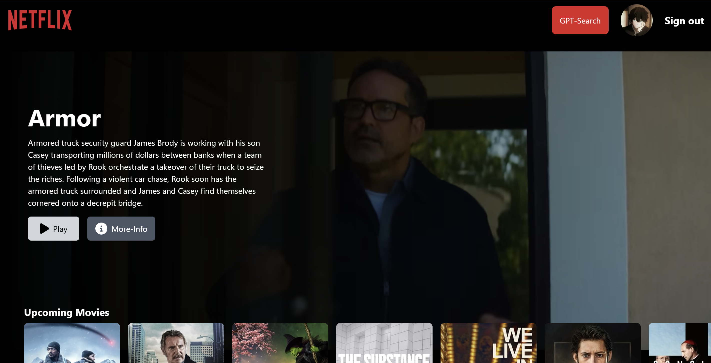
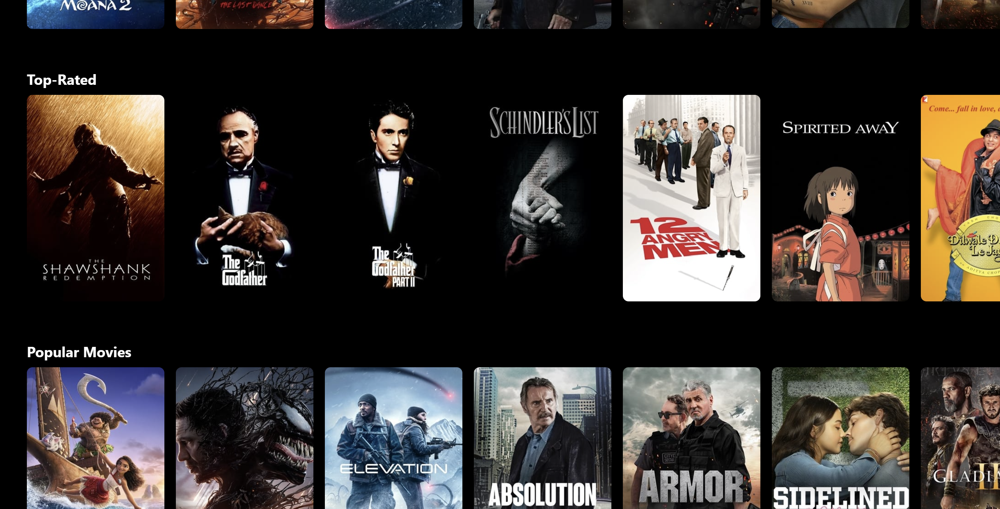
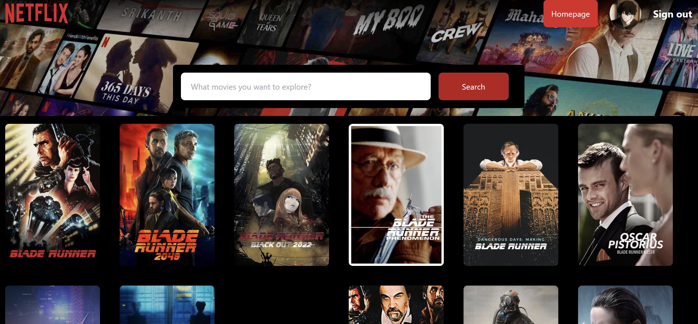

# Netflix GPT Application

Welcome to our AI-driven Movie Recommendation App! This application offers a personalized movie recommendation experience by leveraging user authentication and the TMDB (The Movie Database) API. Users can sign up and log in to access tailored movie suggestions, making it easier to find their next favorite film. Whether you're a movie enthusiast looking for something new or just exploring different genres, this app provides a seamless and engaging way to discover movies.

## Table of contents

- [Overview](#overview)
  - [Project Outline](#project-outline)
  - [Detailed Clarifications](#detailed-clarifications)
  - [Screenshot](#screenshot)
  - [Links](#links)
- [My process](#my-process)
  - [Built with](#built-with)
- [Author](#author)

## Overview

### Project Outline

#### 1. Authentication System
- User registration, login, logout
- Email verification and password reset

#### 2. UserProfile Page
- Display user information
- Edit profile functionality

#### 3. BrowsePage
- Movie recommendations carousel
- Trailer background
- Recommendation algorithm integration

#### 4. Individual MoviePage
- Movie details: synopsis, cast, genre, release date, rating
- Trailer and image gallery
- User reviews and ratings

#### 5. GPT Integration
- Personalized recommendations via GPT
- Chatbot or interactive search

#### 6. Responsive Layout
- Use CSS frameworks like Bootstrap or Tailwind CSS
- Ensure compatibility across devices

#### 7. Interactive Elements
- Clear hover and focus states
- Visual feedback for all interactions

### Detailed Clarifications

#### Authentication System
- Implement a secure sign-up and login system using Firebase's built-in authentication.

#### UserProfile Page
- Create a profile model to store user information such as username, email, avatar, bio, and other necessary details.
- Allow users to update their profile information and upload a profile picture.

#### BrowsePage
- Display movie recommendations using a carousel component.
- Show a trailer in the background for the highlighted movie.

#### Individual MoviePage
- Display more information about the movie, such as title, synopsis , rating.
- Include a trailer and possibly a gallery of images or stills from the movie.

#### GPT Integration
- Integrate GPT to provide personalized movie recommendations or to answer user queries about movies.
- Implement a interactive search feature powered by GPT.

#### Responsive Layout
- Use responsive design techniques to ensure the interface adapts to different screen sizes.
- Test on various devices to ensure a consistent user experience.

#### Interactive Elements
- Ensure all buttons, links, and other interactive elements have clear hover and focus states.
- Provide visual feedback to enhance user interaction and accessibility.

### Screenshot

### Links

- Solution URL: [Github url](https://github.com/NC-Aravindh/netflix-gpt)
- Live Site URL: [Live Demo](https://netflixgpt-dc87a.web.app/)

## My process

### Built with

- [React](https://reactjs.org/) - JS 
- [Redux](https://redux.js.org/)
- [Firebase](https://firebase.google.com/docs)
- [Open AI](https://platform.openai.com/docs/api-reference/introduction)
- Create React App
- Semantic HTML5 markup
- CSS 

## Author
- Aravindh NC

